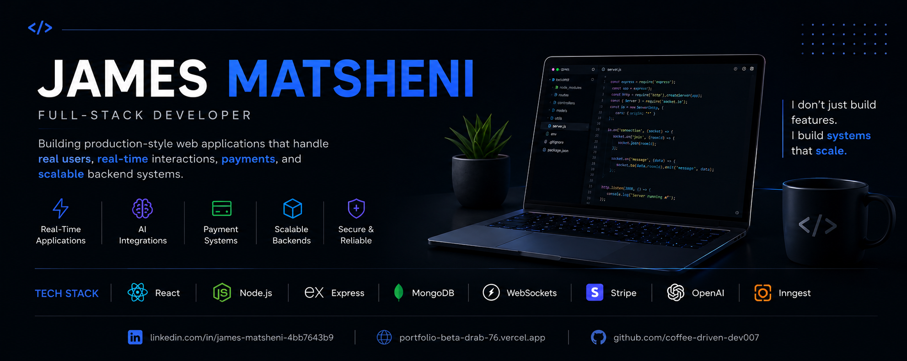

  

  <b>Building real-time systems that scale under real-world pressure</b>

---

# 👋 Hi, I'm James Matsheni

### I design and build real-time, production-grade systems that handle concurrency, scale, and real users in production environments.

Full-Stack Developer | Real-Time Systems | AI Integrations | Payment Platforms

I specialize in backend-heavy, system-driven applications — focusing on scalability, reliability, and real-world engineering constraints like concurrency, authentication, and payments.

---

## 🚀 Tech Stack

**Frontend**  
React  

**Backend**  
Node.js · Express  

**Database**  
MongoDB  

**Realtime & Events**  
WebSockets · Inngest  

**Payments & AI**  
Stripe · OpenAI  

---

## 🧠 Engineering Focus

- ⚡ Real-time systems (WebSockets, live synchronization, concurrency handling)  
- 🏗️ Scalable backend architecture (Node.js + MongoDB)  
- 🔐 Secure authentication & authorization systems  
- 💳 Payment processing systems (Stripe integration)  
- 🤖 AI-powered applications (OpenAI API workflows)  
- ⚙️ Event-driven architectures (Inngest)  

---

## 💼 Featured Projects

### 🎬 Popcorn Palace  
#### Real-time movie booking system with concurrency-safe seat allocation

🔗 https://booking-app-five-mu.vercel.app  

- Stripe payment integration  
- Clerk authentication + role-based access control  
- Real-time seat booking with concurrency handling  
- Event-driven notifications (Inngest)  
- Admin dashboard for managing movies & showtimes  

---

### ⚽ Pitchside  
#### AI-powered football content generation platform

🔗 https://soccer-blog-nine-vercel.app  

- AI-generated articles using OpenAI API  
- Admin moderation and approval workflow  
- Full CMS (CRUD system + content management)  
- MongoDB-based structured data storage  

---

### 🎨 Real-Time Whiteboard  
#### Multi-user real-time collaborative drawing system

🔗 https://real-time-white-board-wheat.vercel.app  

- WebSockets-based live collaboration  
- Instant synchronization across multiple users  
- Export functionality (PNG / PDF)  
- Low-latency real-time interaction system  

---

### 🍔 KFC Delivery System  
#### Full-stack e-commerce ordering and payment platform

🔗 https://kfc-delivery-application.vercel.app  

- Cart → checkout → payment flow  
- Stripe payment integration  
- Admin order management system  
- Authentication + session handling  

---

### 🌐 Portfolio Website  
#### Personal developer portfolio showcasing production systems

🔗 https://portfolio-beta-drab-76.vercel.app  

- Modern responsive UI  
- Project showcase system  
- Contact and social integration  
- Production deployment  

---

## 📊 GitHub Stats

  
  

---

## 📈 Engineering Philosophy

I care less about features — and more about how systems behave under real-world conditions.

- System design & scalability  
- Real-time distributed systems  
- Production-grade backend architecture  
- API reliability and performance  

---

## 📫 Let’s Connect

- LinkedIn: https://www.linkedin.com/in/james-matsheni-4bb7643b9  
- Portfolio: https://portfolio-beta-drab-76.vercel.app  
- GitHub: https://github.com/coffee-driven-dev007  

---

## ⚡ Closing Statement

> I don’t build demos. I build systems that behave correctly under real users, real traffic, and real-world constraints.
